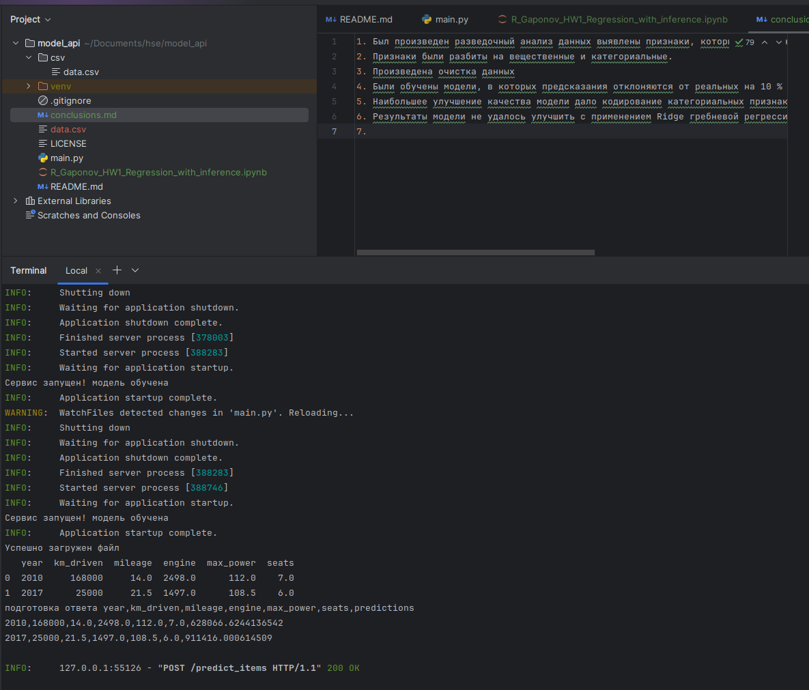
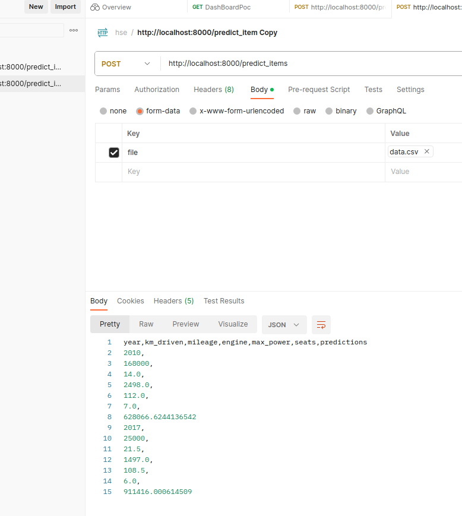
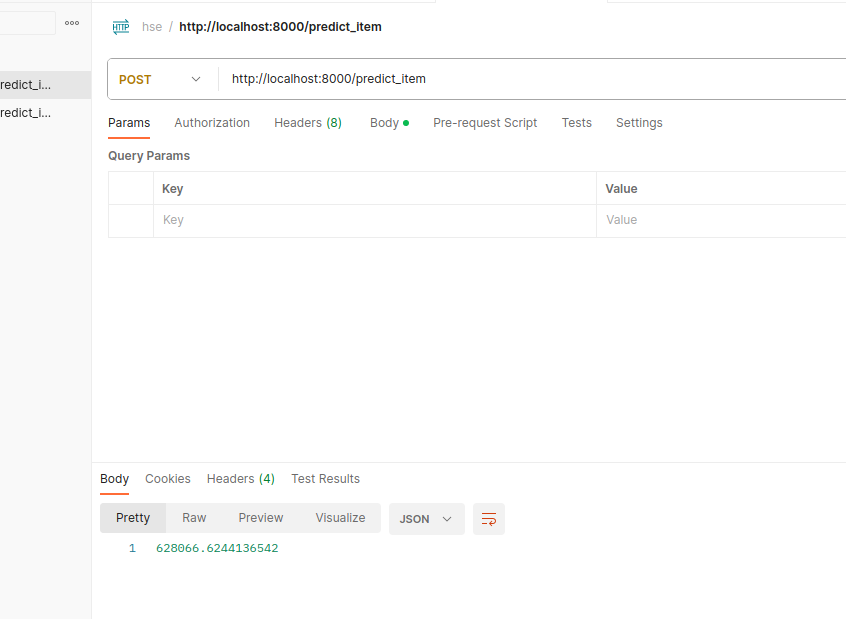

1. Был произведен разведочный анализ данных выявлены признаки, которые влия.т на цену автомобилей, а ткже выявлены, которые не влияют
2. Признаки были разбиты на вещественные и категориальные. 
3. Произведена очистка данных
4. Были обучены модели, в которых предсказания отклоняются от реальных на 10 % в 8% случаев
5. Наибольшее улучшение качества модели дало кодирование категориальных признаков и обучение модели с их помощью
6. Результаты модели не удалось улучшить с применением Ridge гребневой регрессии
7.  Работа сервиса с логами
8.  Ответ в постмане в виде csv файла
9.  Ответ в постмане в виде float числа